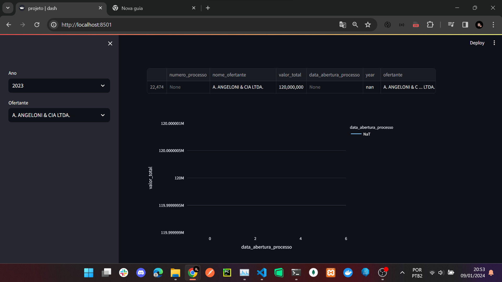
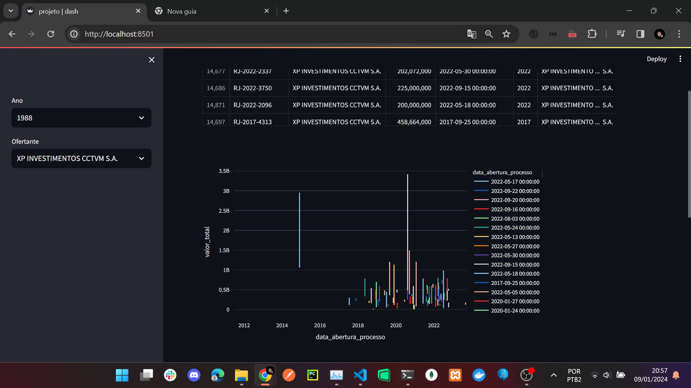
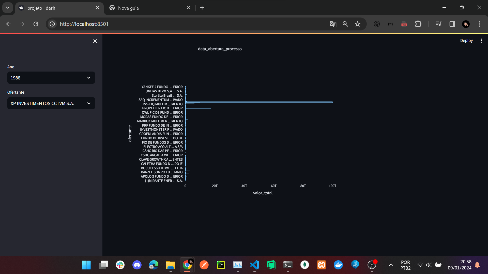

# Study of dashboard building using python

### To run

Run install.bat

- install dependencies
- create venv
- run server

### Screeshoots

### Reference

[Streamlit - Server and low code tools](https://streamlit.io/)

[Plotly - Chart Tools](https://plotly.com/python/plotly-express/)

[Video by Asimov - Building Dashboard in 15 minutes](https://www.youtube.com/watch?v=P6E_Kts9pxE)